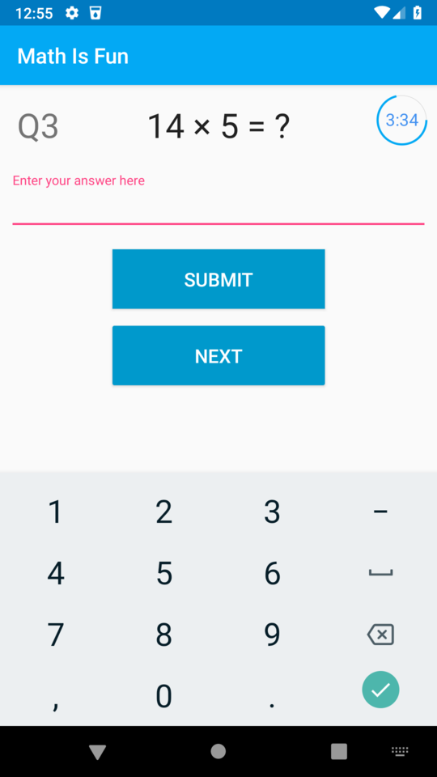
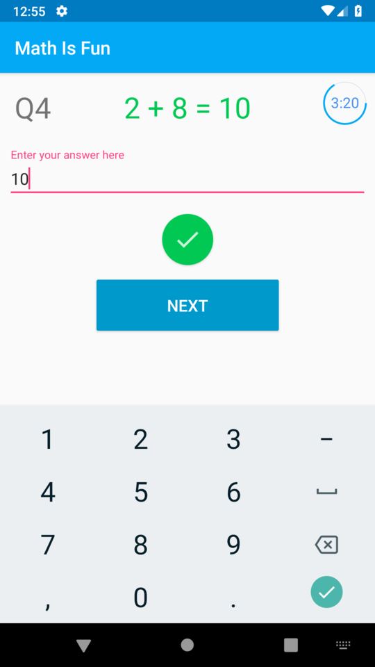
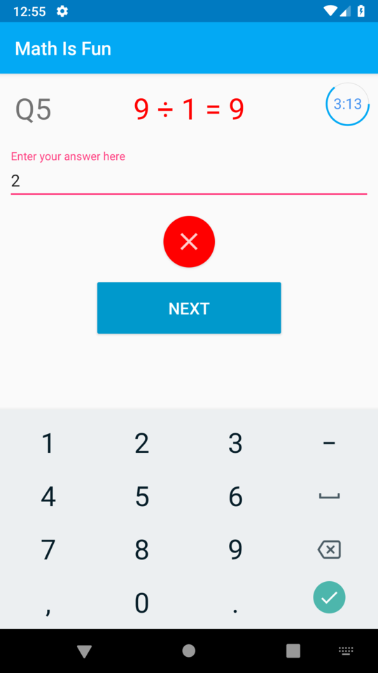
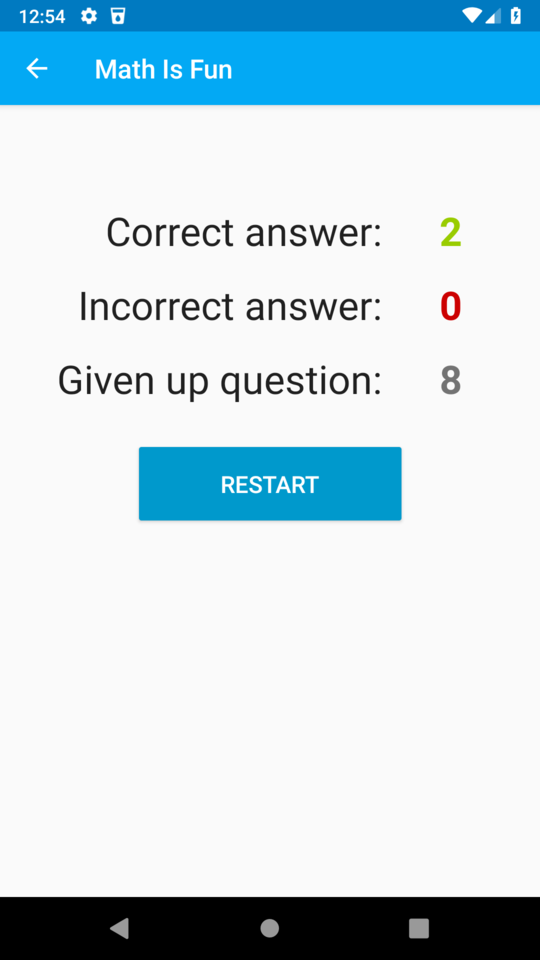

# Math Is Fun

An Android application uses to teach the pre-school student basic mathematics operation including addition, subtraction, multiplication and division interactively. 

## Features

* 10 random question
* 5 minutes timer on the screen
* Read out the answer and total number of correct answer

## Getting Started

The following guide will help you download the project to the local machine, compile, and run it.

### Prerequisites

* Android Studio
* Android device / AVD

### Installing

1.  Clone or download the project as zip from GitHub.
2.  From the Android Studio menu click File > New > Import Project.
3.  Skip the Gradle update reminder.
4.  Install missing platform and sync project if prompt.
5.  Run.

## Screenshots

## Authors

* **Kiros Choi** - [KirosC](https://github.com/KirosC)

## Acknowledgement

* [CircleProgress](https://github.com/lzyzsd/CircleProgress) - Button animation
* [android-morphing-button](https://github.com/dmytrodanylyk/android-morphing-button) - Button animation
